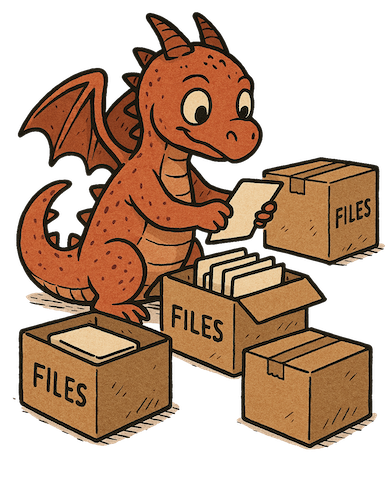

# Backup LEGENDLab PC



Simple script to backup the software installation of the DAQ computer in the LEGENDLab at TUM using `borgbackup`.

## Setup borgbackup

(as root)

```bash
apt-get install borgbackup
```

generate ssh key (and create user on server)

```bash
ssh-keygen -t ed25519 -C "user@legendlab"
```

and generate ssh config

```bash
Host artemis
   HostName AAA.BBB.CCC.DDD
   port 22
   user legendlab
   IdentityFile ~/.ssh/legendlab
```

## Backup script

Prepare script env.

```bash
chmod +x *.sh
mkdir log
```

Add a cron job to run the scripts once every two hours:

```bash
# m h  dom mon dow   command
0 */2 * * * /usr/bin/bash /home/legend/software/LEGENDLab-Backup/backup.sh
15 */2 * * * /usr/bin/bash /home/legend/software/LEGENDLab-Backup/prune.sh
16 */2 * * * /usr/bin/bash /home/legend/software/LEGENDLab-Backup/prune_log.sh
```

(view the crontab with `crontab -l`)

## Use borgbackup

Initate borgbackup

```bash
borg init --encryption=none artemis:/mnt/artemis02/users/legendlab/backup/FCDAQ-2025
```

useful commands:

```bash
borg info artemis:/mnt/artemis02/users/legendlab/backup/FCDAQ-2025
borg list artemis:/mnt/artemis02/users/legendlab/backup/FCDAQ-2025
```
